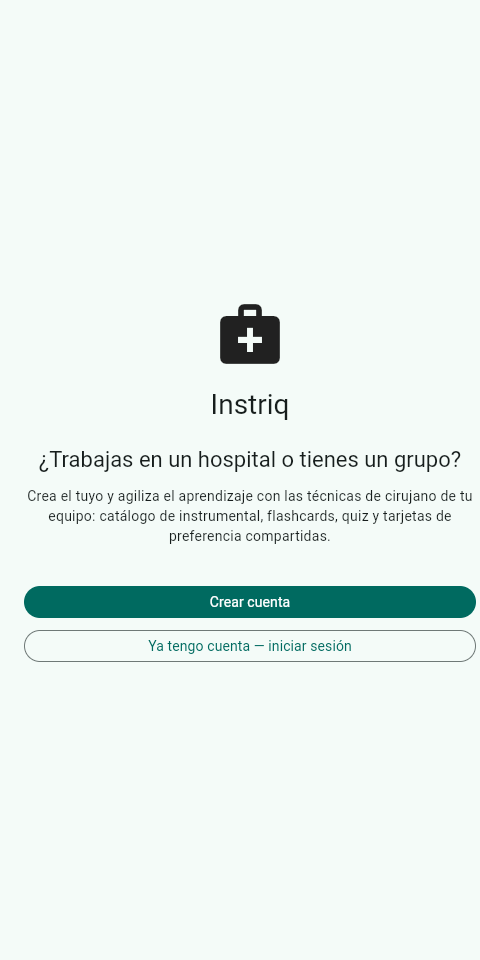
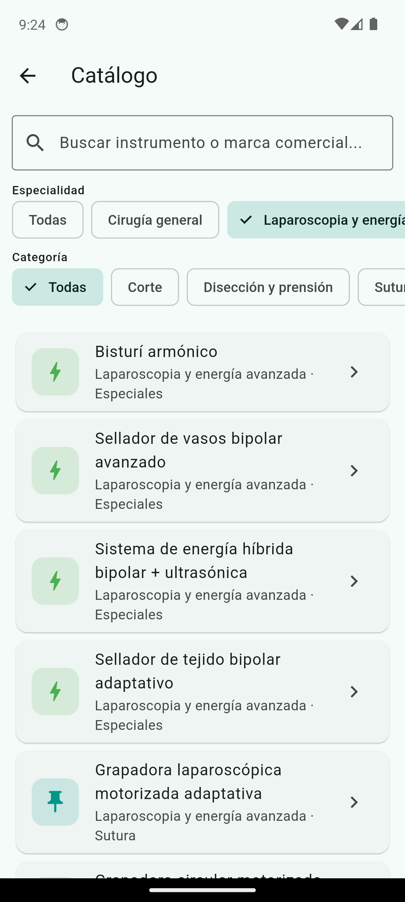
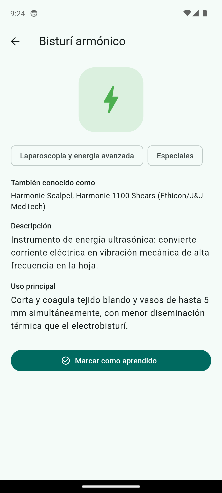
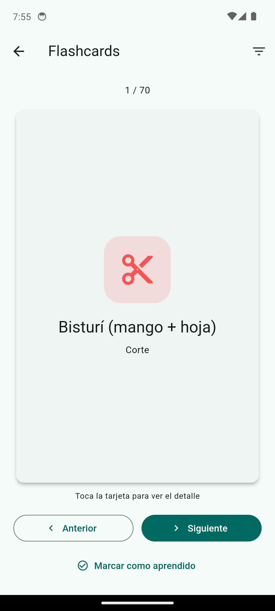

# Instriq

App multiplataforma (Flutter: Android, iOS, Web) para que el personal de quirófano aprenda el instrumental quirúrgico de forma interactiva, y para que un hospital o grupo comparta sus propias tarjetas de preferencia de cirujano — sustituyendo las carpetas de papel desactualizadas por algo que se lleva en la tablet o el móvil.

El uso básico (catálogo, flashcards, quiz, progreso) **no requiere cuenta**. Solo hace falta iniciar sesión si quieres unirte o crear el espacio compartido de tu hospital.

## Capturas

| Bienvenida | Catálogo | Detalle | Flashcards |
|---|---|---|---|
|  |  |  |  |

## Funcionalidades

- **Catálogo**: instrumental organizado por especialidad (cirugía general, laparoscopia/energía avanzada, robótica, ortopedia/trauma, neurocirugía, cardiovascular, ginecología/obstetricia, urología, ORL) y por categoría funcional (corte, disección, sutura, separación, succión, especiales). Cada instrumento incluye nombres comerciales y fabricante como alias (ej. "LigaSure" de Medtronic, "Harmonic" de Ethicon).
- **Aprende**: flashcards y quiz de opción múltiple con mejor puntuación guardada.
- **Progreso**: seguimiento local de instrumentos aprendidos por categoría.
- **Tarjetas de preferencia**: instrumental específico por cirujano y procedimiento, compartido entre el personal del mismo hospital vía Supabase, con marca de "validado por el cirujano".
- **Alta de hospital por autoservicio**: cualquier persona (jefa de quirófano o quien quiera) puede registrar su hospital o grupo y queda como administradora — puede regenerar el código de invitación y gestionar miembros.
- **Modo claro/oscuro** con toggle manual persistente.

## Stack técnico

- **Flutter** (Dart) — Android, iOS y Web desde el mismo código.
- **Supabase** — Auth (email/contraseña), Postgres con Row Level Security, API REST autogenerada.
- **shared_preferences** para progreso y preferencia de tema local (funciona sin cuenta).

## Estructura del proyecto

```
lib/
  models/       # Instrument, PreferenceCard, Hospital, HospitalMember
  data/         # Catálogo de instrumental (const, ~70 instrumentos)
  services/     # Supabase, auth, perfil/hospital, progreso, tema
  screens/
    auth/       # Bienvenida, login/registro, alta de hospital, flujo de conexión
    admin/      # Gestión de hospital (código, miembros)
    ...         # Catálogo, Aprende (flashcards/quiz), progreso, tarjetas
  utils/        # Generador de código de invitación
supabase/       # Esquema SQL (ejecutar en orden: schema.sql, schema_v2, schema_v3)
```

## Desarrollo

```bash
flutter pub get
flutter run                 # dispositivo/emulador Android o iOS conectado
flutter run -d chrome        # navegador
```

### Backend (Supabase)

1. Crea un proyecto en [supabase.com](https://supabase.com).
2. En el SQL Editor, ejecuta en orden: `supabase/schema.sql`, `supabase/schema_v2_hospital_admin.sql`, `supabase/schema_v3_fix_rls_recursion.sql`.
3. Copia la URL y la **publishable key** (Project Settings → API) a `lib/services/supabase_config.dart`. Es pública/segura de commitear — la seguridad real la da Row Level Security, no el secreto de esta key.

## Despliegue

- **App** (`app.instriq.org`): Vercel. El repo incluye `vercel.json` + `vercel_build.sh` — como Vercel no trae Flutter preinstalado, el script clona el SDK stable en cada build y compila con `flutter build web --release`. Basta con importar el repo en Vercel (framework preset "Other") y conectar el subdominio desde Cloudflare con un CNAME a `cname.vercel-dns.com`.
- **Landing** (`instriq.org`): carpeta `landing/`, HTML estático sin build — pensada para Cloudflare Pages (directorio raíz `landing/`). Incluye la política de privacidad (`landing/privacidad.html`).

## Licencias

- **Código**: [AGPL-3.0](LICENSE).
- **Documentación**: CC BY-SA 4.0.
- **Fotos de instrumental**: Wikimedia Commons con licencia libre verificada (CC0/CC-BY/CC-BY-SA); la atribución de cada una se muestra en la propia app, junto a la imagen.

## Estado / roadmap

- [x] Fotos reales de instrumental con licencia libre (19/70, resto sigue con icono por categoría)
- [x] Landing informativa + política de privacidad en `instriq.org`
- [ ] Exportar/eliminar cuenta (GDPR)
- [ ] Analítica de comunidad agregada y anónima (instrumental más consultado, especialidades con más actividad)
- [ ] Sistema de donaciones transparente
